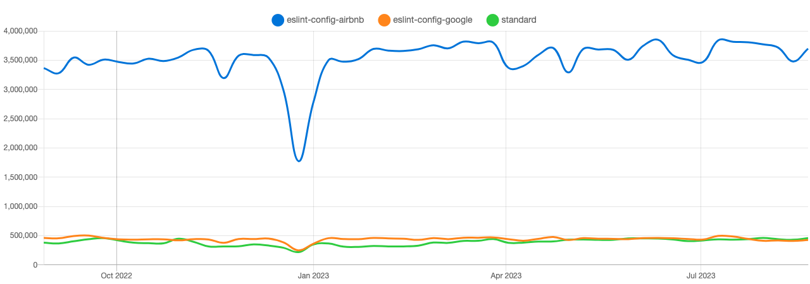

### Confluence이란?

"Jira"와 "Confluence" 모두 협업 효율을 위해 호주 Atlassian사에서 개발한 Tool

Jira는 프로젝트 관리(작업에 대한 일정과 진행 상황)를 위한 도구이고 Confluence는 문서 관리(요구사항 명세서, 회의록 등)를 위한 도구이다.

### 전 기수들은 문서화 도구를 어떻게 했는지

전 기수들보면 노션과 깃허브 이슈를 많이 활용한것 같다.

### 이슈관리

이슈관리 써본적이 별로 없어서 전 기수 레포를 참고하였습니다.

- commit 규칙(Feat,Refactor,Fix 등등)을 라벨로 만들어 놓았다.
- 이슈를 만들고 브랜치를 생성해서 작업하였다.

⇒ 문서화 도구에 대한 저의 의견을 정리해보자면

1. 규모가 큰 프로젝트라면 Jira나 Confluence를 써보는것도 좋을것같지만, 현재 저희의 프로젝트 규모로는 Jira는 깃허브 이슈관리로, Confluence는 노션으로 충분히 대체 가능해보였습니다.
2. 생소한 플랫폼이다보니 러닝커브가 높지않을까..? 예상해봅니다.
3. 하지만 실제로 현업에서 많이 사용되고 있다면 이번 기회에 써보는 것도 좋은 경험이라고 생각합니다.

### eslint 규칙

어디까지 자료 조사를 해야할지 몰라서ㅠㅠ일단 시간관계상 가볍게 어떤 룰이 많이 사용되는지랑 airbnb관련 규칙은 어디서 볼수있는지 알아보았습니다. 아니면 룰을 적용하면 아무래도 조금 더 엄격한 느낌이다보니..꼭 룰을 적용하는 것이 아닌 멘토님 말씀처럼 recommended규칙만 사용해도 좋을것같습니다!

airbnb가 압승..?
airbnb 관련 규칙은 https://github.com/airbnb/javascript/tree/master/react 참고 부탁드립니다!

https://npmtrends.com/eslint-config-airbnb-vs-eslint-config-google-vs-standard 참고 부탁드립니다!
