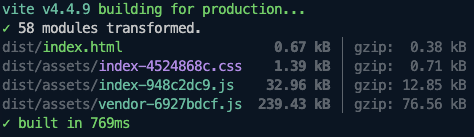
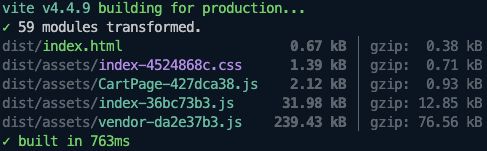

브라우저 화면 렌더링 시 불필요한 리소스를 최소화 할 수 있는 방법인
코드 스플리팅에 대해 알아보도록 하겠습니다.

# 코드 스플리팅이란?

- Vite나 Webpack과 같은 프론트엔드 빌드 도구들은 개발한 코드들을 하나의 파일로 묶어서 브라우저에서 실행할 수 있도록 합니다.

  - 이렇게 묶은 파일은 **번들(bundle)** 이라고 합니다. (ex. 이미지, CSS, JS)
  - 번들 파일을 HTML 문서에 추가하여 배포할 수 있습니다.

그런데 개발을 하면서 애플리케이션이 커지게 되면 이 **번들 파일의 크기도 증가**하게 됩니다.

- 브라우저는 렌더링을 할 때, JavaScript의 로딩 및 실행이 끝날 때 까지 HTML 파싱을 멈춥니다. 
- 번들 파일의 크기가 커지면 커질수록 브라우저가 HTML 파싱을 멈추는 시간이 길어지게 되고, 이는 좋지않은  **사용자 경험(UX)** 을 초래할 가능성이 높습니다. 
- 그래서 초기 로딩 시의 번들 파일의 용량 증가를 막을 수 있도록 필요한 코드만 로딩할 수 있는 방법을 사용합니다.
  - 이 방법을 **코드 스플리팅(Code Splitting)** 이라고 합니다.

아래와 같은 효과를 낼 수 있습니다. 메인 페이지에서는 CartPage가 필요없기 때문에, 나중에 로딩할 수 있도록 코드 스플리팅을 수행할 수 있습니다.





---

## React에서 코드 스플리팅 하는 방법

React에서 코드 스플리팅을 하는 방법은 크게 2가지가 있습니다.

### 동적 import

동적 import는 import 구문을 함수로 감싸서 사용하는 방법입니다. 이렇게 하면 해당 import 구문은 함수가 호출될 때 실행되기 때문에, 필요한 시점에 필요한 모듈을 로딩할 수 있습니다.

    
```jsx
// App.js
import React, { useState } from 'react';

function App() {
  const [isShow, setIsShow] = useState(false);

  return (
    <div>
      <button onClick={() => setIsShow(true)}>Show</button>
      {isShow && (
        <div>
          {import('./LazyComponent').then(({ default: LazyComponent }) => (
            <LazyComponent />
          ))}
        </div>
      )}
    </div>
  );
}
export default App;
```


```jsx
// LazyComponent.js
import React from 'react';

function LazyComponent() {
  return <div>Lazy Component</div>;
}

export default LazyComponent;
```


- 위와 같이 동적 import를 사용하면, `LazyComponent`가 필요한 시점에 로딩되기 때문에 초기 로딩 시에는 필요하지 않은 리소스를 로딩하지 않아도 됩니다.

- 하지만 이 방법은 동적 import 구문이 실행되기 전까지는 `LazyComponent`가 로딩되지 않기 때문에, 로딩 시간이 필요한 시점에 추가적으로 발생하게 됩니다.
  - 그래서 이 방법은 초기 로딩 시간을 줄이는데는 도움이 되지만, 필요한 시점에 로딩되기 때문에 **사용자 경험**을 떨어뜨릴 수 있습니다.

### React.lazy
`React.lazy`는 React에서 제공하는 코드 스플리팅을 위한 기능입니다. React.lazy를 사용하면 동적 import를 사용하는 것과 같은 효과를 얻을 수 있지만, React.lazy는 동적 import를 사용하는 것보다 더 간편하게 코드 스플리팅을 할 수 있습니다.
  
```jsx
// App.js
import React, { useState, Suspense } from 'react';

const LazyComponent = React.lazy(() => import('./LazyComponent'));

function App() {
  const [isShow, setIsShow] = useState(false);

  return (
    <div>
      <button onClick={() => setIsShow(true)}>Show</button>
      {isShow && (
        <div>
          <Suspense fallback={<div>Loading...</div>}>
            <LazyComponent />
          </Suspense>
        </div>
      )}
    </div>
  );
}

export default App;
```
  
```jsx
// LazyComponent.js
import React from 'react';

function LazyComponent() {
  return <div>Lazy Component</div>;
}

export default LazyComponent;
```
  
- 위와 같이 React.lazy를 사용하면, LazyComponent가 필요한 시점에 로딩되기 때문에 초기 로딩 시에는 필요하지 않은 리소스를 로딩하지 않아도 됩니다.

- React.lazy를 사용하면, Suspense 컴포넌트를 사용하여 로딩 시간에 대한 fallback UI를 설정할 수 있습니다.
- Suspense 컴포넌트는 React.lazy와 함께 사용되어야 하며, fallback UI는 Suspense 컴포넌트의 props로 전달되어야 합니다.
- fallback UI는 LazyComponent가 로딩되는 동안에만 보여지게 됩니다.

## 코드 스플리팅의 단점

- 코드 스플리팅을 하면 초기 로딩 시간을 줄일 수 있지만, 해당 코드가 필요한 시점에 로딩되기 때문에 사용자 경험을 떨어뜨릴 수 있습니다.
- 코드 스플리팅을 무작정 사용하면 안되고 애플리케이션 성능과 사용자 경험을 고려하여 전략을 잘 세워야 합니다.
- **프리로딩(Preloading)**, **프리페칭(Prefetching)** 과 같은 방법을 결합해서 사용하면 웹 애플리케이션의 성능을 향상시키고 사용자 경험을 개선하는 데 도움이 됩니다.
  - 번들러에 따라 프리로딩, 프리페칭을 지원하는 방식이 다르기 때문에, 번들러의 공식문서를 참고하여 사용해야 합니다.

## 추가로 궁금한 점

- CSS 파일은 어떻게 스플리팅 할 수 있을까?
- SSR 방식으로 구현해야 한다면 코드 스플리팅을 어떻게 할 수 있을까?

--- 

## 참고자료

[리액트 공식문서 (이전)](https://ko.reactjs.org/docs/code-splitting.html)

[기초부터 완성까지, 프런트엔드](https://www.yes24.com/Product/Goods/105266398)

[Vite 공식문서](https://ko.vitejs.dev/guide/features.html#preload-directives-generation)
