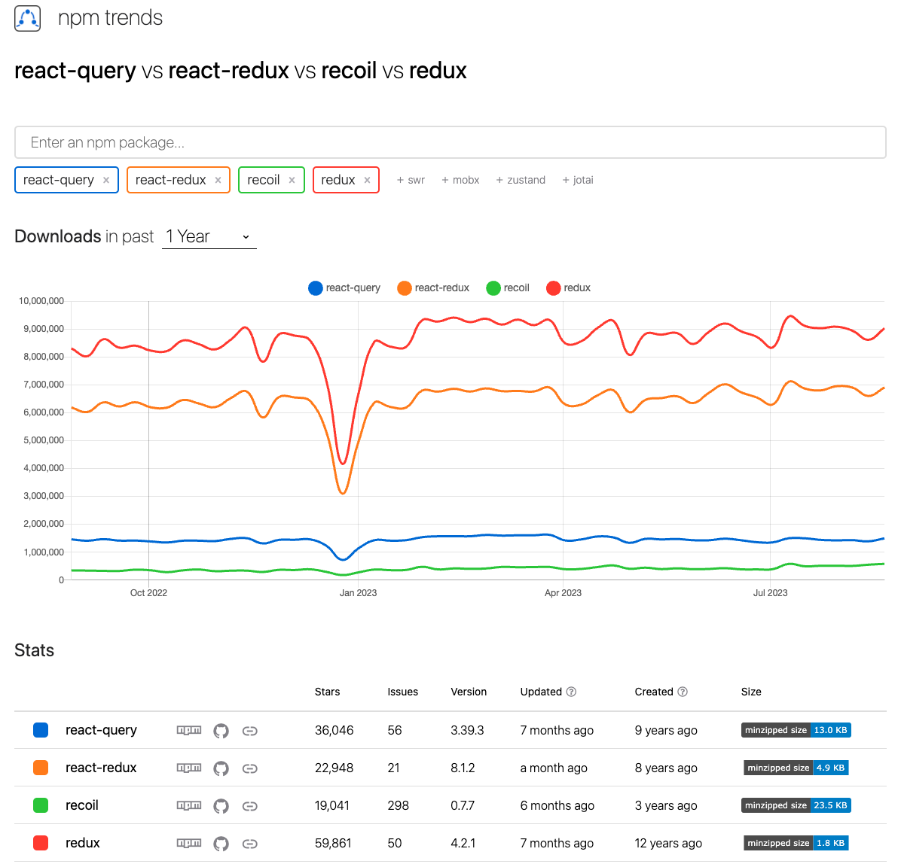

# 상태 관리 (State Management)

## 상태 관리란?

- 웹 애플리케이션의 `상태(state)`는 사용자가 앱과 상호작용하면서 변화하는 데이터를 의미합니다.
- 그리고 `상태 관리`는 애플리케이션의 상태(data, UI 상태 등)를 효과적으로 조작하고 관리하는 것을 의미합니다. 

- 상태 관리는 **애플리케이션의 복잡성**에 따라 다양한 수준으로 필요하게 됩니다.
   - 간단한 앱 이라면, **React**의 useState나, **Vue**의 data같은 로컬 상태만으로도 충분할 수 있습니다.

현대의 복잡한 웹 애플리케이션에서 상태는 많은 컴포넌트들과 모듈 사이에서 공유되기 때문에, 그 상태를 예측 가능하고 통제 가능한 방식으로 관리하는 것이 중요해졌습니다.

## 상태 관리의 목적

1. 일관성: 애플리케이션의 **여러 부분에서 동일한 상태**를 유지하고자 할 때 사용합니다.
2. 디버깅과 테스트: 상태를 한 곳에서 관리하면, 애플리케이션의 다른 부분에서 상태 변경 시 발생하는 **버그**를 쉽게 찾을 수 있습니다.
3. 코드 재사용: **공통 로직**을 쉽게 재사용할 수 있습니다.
4. 성능 최적화: **필요할 때만 UI를 업데이트**하여 성능을 최적화할 수 있습니다.
5. 비즈니스 로직 분리: 상태 관리 라이브러리를 사용하면, **비즈니스 로직과 UI 로직을 분리**할 수 있습니다.
6. 코드 유지 보수: 상태 관리 라이브러리를 사용하면, 코드를 **쉽게 유지 보수**할 수 있습니다.

## 상태 관리 라이브러리의 비교 및 분석



(npm trends)

### 1. Redux / React-Redux

#### 특징
- 가장 오래되고, 유명한 라이브러리입니다.
- **Redux**는 상태를 **하나의 객체**로 관리합니다.
- **Reducer**와 **Flux** 패턴을 기반으로 만들어져서 이름이 **Redux**입니다.
- **Reducer**는 **순수함수**로 작성되어야 합니다.
- **Action**과 **Reducer**를 사용하여 명시적으로 상태를 관리합니다.
- 커뮤니티가 충분히 성숙하며 많은 플러그인들을 지원합니다.

#### 장점
- 기본적으로 간단한 구조를 가지고 있으며 추가적인 기능들은 플러그인을 통해 지원합니다.
- 많은 플러그인들이 존재하며, 커뮤니티가 활발합니다.
- 커뮤니티와 문서의 지원을 받기가 용이합니다.
- 미들웨어를 활용한 로직 제어가 용이합니다.
- 유연성과 확장성이 높습니다.

#### 단점
- 많은 플러그인들로 인해 피로도가 높고, 학습 곡선이 높습니다.
- Action 타입, Reducer등으로 인해 **BoilerPlate** 코드가 많이 발생합니다.
   - 코드가 장황해질 수 있습니다.
- Redux의 초기 설정이 다소 복잡하며, TypeScript와 함께 사용할 때는 추가 타입 지정으로 인해 더 복잡해집니다.

### 2. Recoil

#### 특징
- `React`의 상태 관리를 위해 **meta**에서 만든 라이브러리입니다.
- **Atom**과 **Selector**를 사용하여 상태를 관리합니다.
   - **Atom**은 **상태**를 의미하고, **Selector**는 **Atom**을 가공하여 새로운 **상태**를 만들어내는 함수입니다.
- 그래프 기반의 상태 관계 설정이 가능합니다.
- `React`처럼 **hooks**를 사용하여 상태를 관리합니다.

#### 장점
- `React`의 상태 관리를 위해 만들어져서, `React`와의 호환성이 뛰어납니다.
- **Atom**과 **Selector**를 사용하여 상태를 관리하기 때문에, **Redux**보다 코드가 간결합니다.
- 기본적인 기능들을 제공하고 있어서, 추가적인 플러그인을 설치할 필요가 없습니다.
- 다른 라이브러리들과 비교해서 학습 곡선이 낮습니다.

#### 단점
- 아직까지는 **Redux**나 **MobX**와 같은 라이브러리들보다 커뮤니티가 활발하지 않습니다.
- (글 작성 시점) 현재 버전이 0.7.7이라 아직 실험적인 라이브러리입니다.
   - (글 작성 시점) 업데이트 주기가 현저히 느려졌습니다.

### 3. Context API

#### 특징
- `React`에서 기본적으로 제공하는 상태 관리 라이브러리입니다.
- 아주 간단하게 전역 상태를 관리할 수 있습니다.

#### 장점
- `React`에서 기본적으로 제공하기 때문에, 별도의 설치가 필요하지 않습니다.
- 학습곡선이 낮으며, 간단한 앱에서는 충분히 사용할 수 있습니다.

#### 단점
- `React`에서 기본적으로 제공하기 때문에, 기능이 많이 제한적입니다.
- 단순한 만큼 복잡한 앱에서는 사용하기 어렵습니다.
- 불필요한 리렌더링이 발생하기 쉽습니다.

### 4. React-Query

#### 특징
- **데이터 페칭(Fetching)**, **캐싱(Caching)**, **동기화**, **서버 데이터 업데이트** 등을 쉽게 사용할 수 있게 해주는 라이브러리입니다.
- 기존 상태관리 라이브러리들은 **로컬 상태**를 관리하는데 초점을 맞추고 있습니다.
   - 하지만 `React-Query`는 **서버 상태**와 **로컬 상태**를 동기화하는데 초점을 맞추고 있습니다.
- 서버 상태를 바탕으로 클라이언트를 구성합니다.
   - 중복 요청 방지
   - 오류 시 재시도 로직 제공
   - 주기적인 데이터 갱신
   - 데이터 캐싱
   - 페이지네이션, 무한 스크롤
   - loading, error 등 비동기 라이프사이클 관리

#### 장점
- `React-Query`는 다른 상태관리 라이브러리와 비교해서 코드의 양이 적고 구조가 단순하여 추후 유지 보수가 용이합니다.
- 캐싱을 통해 애플리케이션의 속도를 향상시킵니다.
- 동일한 데이터에 대한 중복 요청을 알아서 방지해줍니다.
- 오래된 데이터의 상태를 파악하여 업데이트를 진행합니다.
- **Garbage Collection(GC)** 을 이용하여 서버 쪽 데이터 메모리를 관리해줍니다.
- **React Hooks**와 유사한 인터페이스를 제공합니다.
- 비동기 과정을 선언적으로 관리할 수 있습니다. (데이터 캐싱, 동기화, 리프레시, 오류 처리 등)

```js
const { data, error, isLoading } = useQuery('todos', fetchTodoList);
```

#### 단점
- 전역 상태관리 라이브러리가 아닌 서버 데이터 관리에 특화되어 있습니다.
   - 최근에는 **react-query**로 서버 데이터를 관리하고 **context api**나 **recoil, jotai** 등 전역 상태관리 라이브러리와 연동하여 사용하는 경우가 많습니다.
- 많은 기능을 제공하는 만큼 학습 곡선이 높은 편입니다.
   - (하지만 추가 기능을 플러그인에 위임하여 사용하는 라이브러리들보단 피로도와, 학습 곡선이 낮다고 생각합니다.)
- **react-query**는 **react**에 종속적입니다.
   - **react**를 사용하지 않는 프로젝트에서는 사용할 수 없습니다.
   - **react**를 사용하지 않는 프로젝트에서는 **swr**을 사용하는 것을 추천합니다.

## 참고 자료

- [리액트 상태관리 트렌드의 변화](https://www.nextree.io/riaegteu-sangtaegwanri-teurendeuyi-byeonhwa-2/)
- [React Query](https://www.nextree.io/react-query/)
- [[전역상태관리] Context API vs Recoil](https://velog.io/@hyerin0930/%EC%A0%84%EC%97%AD%EC%83%81%ED%83%9C%EA%B4%80%EB%A6%AC-Context-API-vs-Recoil)